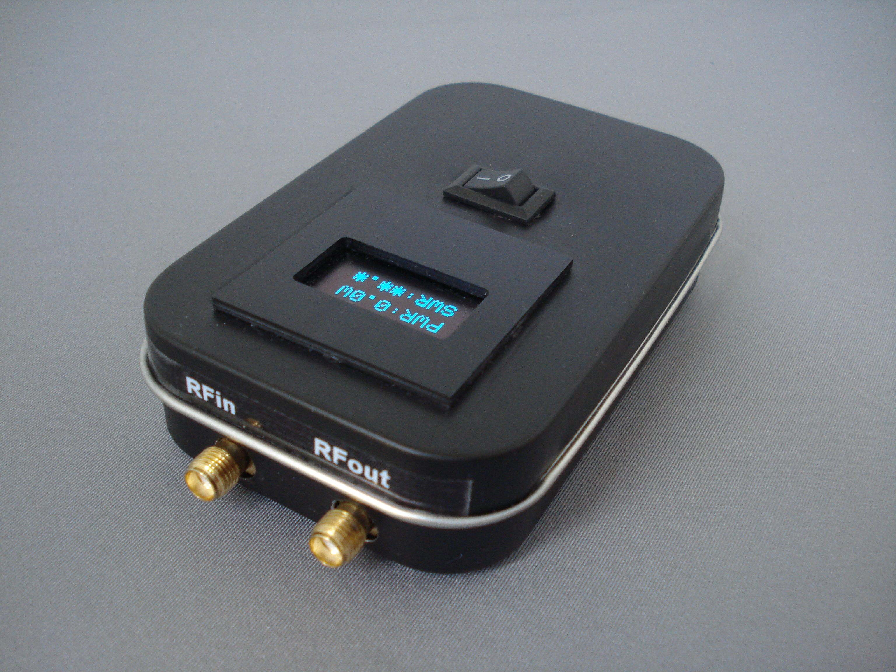
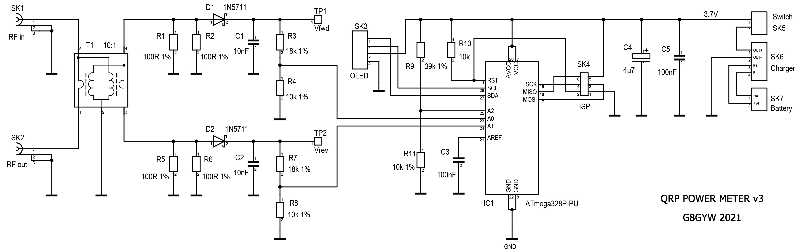

<h2>QRP DIGITAL RF POWER & VSWR METER</h2>

<h3>INTRODUCTION</h3>

Here is a design for a digital QRP RF power meter that fits in a
tobacco tin, complete with battery and charger. It displays average
power from 0.5 Watts to 12 Watts, VSWR and battery voltage.
The component cost, excluding PCB and display bezel, was around £25.

<h3>SCHEMATIC</h3>

<h3>DESCRIPTION</h3>

The design utilises a Tandem coupler (also known as a Stockton bridge). I used a binocular core instead
of the usual pair of toroids as this was smaller and easier to
construct. A 10:1 turns ratio provides 20dB of coupling and 20 to 40dB
of directivity up to 50MHz.

The input waveform is half wave rectified by a 1N5711 Schottky diode.
The resulting dc voltage on TP1 is:

Vfwd = (Vinpk-pk / 20) - Vdiode

where Vdiode is the 1N5711 forward voltage drop (typically 0.33V).

The DC voltages representing forward and reverse power are fed to two
ADC inputs on an Atmega328p processor. To save components this runs on
its internal 8MHz clock and the internal 1.1V bandgap reference is used
as the ADC reference. A third ADC input is used to monitor the voltage
of the rechargeable battery. The display is a 3.3V compatible 0.96"
128x64 OLED.

My first attempts to calculate forward and reverse power were based on this equation:

Pfwd = (20 * (Vfwd + Vdiode))2 / 400

While this worked well for forward power there was a problem when calculating VSWR because
even with a perfect match, where the reverse power is zero, the equation gives a minimum
value of about 100mW due to the presence of the Vdiode term.

I plotted the response of three prototype boards using the excellent Veusz program (https://veusz.github.io/)
and performed a quadratic curve fit of the form ax2 + bx. This returned the values a = 1.0 and b = 0.75
and gave a close fit without the troublesome offset at low power levels.

These curves can be seen in the graph below.

If necessary, the values of a and b can be adjusted in the software to suit the characteristics of the diodes used.

The battery is a 3.7V 150mAh Lithium-Ion Polymer cell as used in many
radio controlled models. These are fitted with a PCB that provides
protection against overcharging and short circuits, but it is important
that they are charged correctly (constant current at 1C then constant
voltage at 4.2V). Fortunately a small charging module based on the
TP4056 IC is available very cheaply and all you need then is a USB lead
and 5 Volt supply. You will also need to change a surface mount resistor
on the charger board to set the current to the correct value (150mA).
This is shown in the photograph below, and the value I used was 8.2k. When
using the charger you have to open the tin lid to see the status LEDs,
but you could remove these and wire the pads to panel mounted ones
instead.

The software is provided as an Arduino sketch. The code includes typical
values for the processor's bandgap reference and the calibration
factors. These parameters can be adjusted during initial testing.

<h3>CONSTRUCTING THE TRANSFORMER</h3>

Winding the transformer is straightforward. Pass 10 turns of 27swg
enamelled copper wire through each hole in the core then strip, twist
and solder the two wires at one end. With the twisted pair at the
bottom, pass a single turn of 24swg wire through the left hand hole,
bend the right hand wire on the other side across to meet it and solder
together. Finally, pass a single turn of 24swg wire through the right
hand hole, bend the left hand wire across and solder. The four stages
are shown below.

<h3>BUILDING THE PCB</h3>

The PCB layout files are here:

[PCB top](pcb%20layout%20top_v3.pdf)

[PCB bottom](pcb%20layout%20bottom_v3.pdf)

Everyone has their own favourite method for making PCBs. I use a laser printer, toner
transfer paper, a laminating machine and ferric chloride. When both sides are etched and the board
is drilled I use an electroless tin plate solution to protect it from tarnishing.

Start the assembly by soldering the surface mount components on the bottom side.
You will need a soldering iron with a fine tip, some 0.5mm diameter solder wire,
flux and strong reading glasses. The Schottky diodes are particularly small and 
it's difficult to see the polarity marking. Finish off by fitting the connectors 
and transformer on the top side. I used a socket for the processor but, as
it's difficult to remove the IC once the PCB is fitted in the tin, I
included an In-System Programming connector (ISP). Note that the SMA
connectors and the earth wire of the transformer are soldered on both
sides of the board to bond the ground planes. Further bonding is
provided by the four fixing screws.

When assembly is complete it's a good idea to do some basic checks
before fitting the processor and mounting the board in the tin.

First inspect the PCB carefully for short circuits. If you have a VNA
you can check the impedance of each RF connector with the other
terminated; they should both be 50 ohms. Then, with RF out terminated,
apply an HF signal between 1 and 10 Watts to RF in. If you don't have
another RF power meter to hand you can check the level with an
oscilloscope and x10 probe connected to the transformer by using the
formula Power = Vpk-pk2 / 400. Measure the DC voltage on TP1 and
compare the result with the Table below.

  | Power In (Watts) | Volts In (pk-pk) | TP1 (Vfwd) |
  |:----------------:|:-----------------:|:-----------:|
  | 1 | 20.0 | 0.7 |
  | 2 | 28.3 | 1.1 |
  | 5 | 44.7 | 1.9 |
  | 10 | 63.2 | 2.8 |

If everything looks good then the board can be fitted to the case. Tobacco tins are
much easier to work with than aluminium cases. I cut out the rectangular
hole for the display bezel with a small cutting disk in a Dremel. The
other holes were made with drills and files. The PCB is attached to the
tin with four M3 screws with nuts underneath to act as stand-offs. The
display bezel is glued to the tin and the battery and charger are attached with sticky pads.

<h3>PROGRAMMING</h3>

There are several ways of programming the processor. My preferred method
is to use the Arduino IDE with the MiniCore Board Manager and a USBasp
programming adapter.

Insert the Atmega328P into the socket and connect a PC or laptop to the
ISP connector via the USBasp adapter. This will power up the board.

The first step is to ensure that the processor has the correct fuse values (E:FF H:D7 L:E2).
These can be changed using AVRDUDE (https://www.nongnu.org/avrdude/) by running the following
in a command window:

avrdude -c usbasp -b 19200 -p m328p -e -U efuse:w:0xFF:m -U hfuse:w:0xD7:m -U lfuse:w:0xE2:m

Now start the Arduino IDE and load [QRP_POWER_METER.ino](QRP_POWER_METER.ino).
Open the Tools menu and replicate the settings shown below, then hold the Shift key and click
the Upload button. When programming is complete the display should show
the startup screen, followed a few seconds later by the measurement
screen.

While still connected to your computer, measure the internal dc
reference voltage on pin 21 with a multimeter. This voltage is stable
but not accurate and can vary between 1.0V and 1.2V. Replace the default
value in the Calibration Factors section of the code with the measured
value and load the program again.

Now connect up the battery, charger and on/off switch, put the switch in
the on position and the screen should display an accurate battery
voltage. With a suitable 50 ohm load on RFout, apply varying power
levels to RFin and observe the readings on the display which should be
within 5% of the true values between 1 and 10 Watts. If the error is significantly higher,
it can be corrected by making small adjustments to the calibration factors
in the code.

Check the VSWR readings using different loads and power levels. Again,
the accuracy should be better than 5% between 1 and 10 Watts.

The maximum power reading is about 12 Watts as the forward voltage approaches the 
upper limit of the ADC input range.

The absolute maximum input level before component damage occurs is about 25 Watts.

<h3>PARTS LIST</h3>

|Circuit Reference|Value|Package|
|:------|:------|:------|
|C1, C2|10nF 50V X7R|0805|
|C3, C5|100nF 50V X7R|0805|
|C4|4µ7 16V Tantalum|1206|
|D1, D2|1N5711|SOD323|
|IC1|ATmega328P-PU|DIL28|
|R1, R2, R5, R6|100R 1%|1206|
|R3, R7|18k 1%|0805|
|R4, R8, R11|10k 1%|0805|
|R9|39k 1%|0805|
|R10|10k 5%|0805|
|SK1|SMA_EDGE_CONNECTOR|
|SK2|SMA_EDGE_CONNECTOR|
|SK3|JST B4B-XH-2|
|SK4|3+3 way PCB header|0.1" pitch|
|SK5|JST B2B-XH-2|
|SK6|JST B4B-XH-2|
|SK7|JST B2B-XH-2|
|TP1|1 Way PCB header|
|TP2|1 Way PCB header|
|Tr1|BN-43-202 Ferrite Core|
<strong>Miscellaneous:</strong>
Tobacco tin
Sub-miniature rocker switch
TP4056 charging module
3.7V LiPo battery
OLED display 0.96" 128x64 3.3V compatible 
Display Bezel
JST plugs 2 and 4 way
